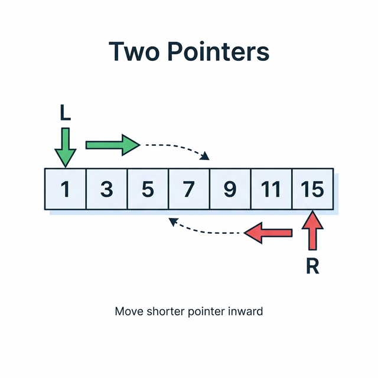
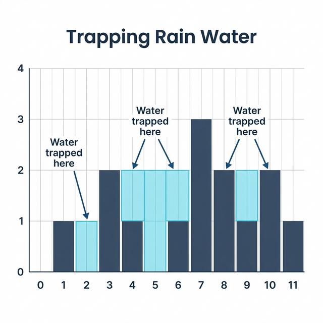
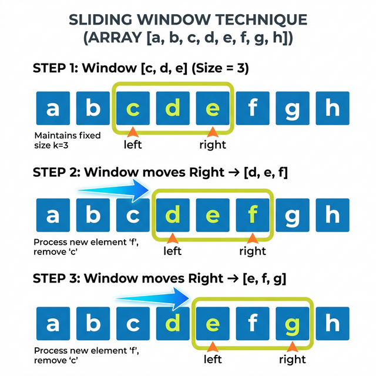
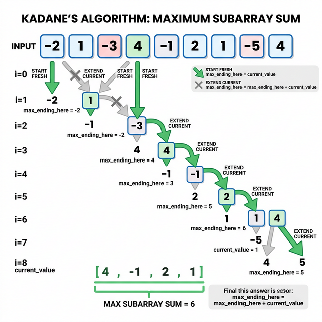
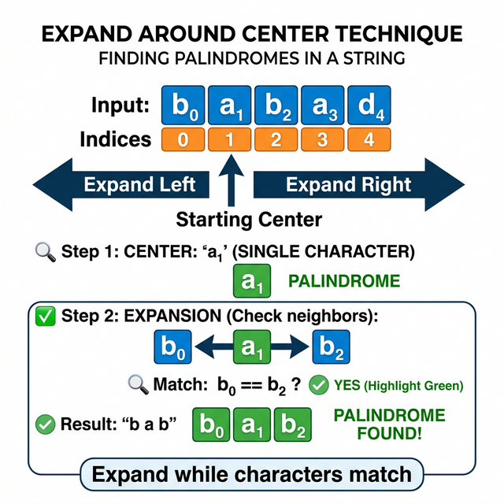

# Day 1 — Arrays and Strings

## Building the Foundation

**What this day covers:** [Big-O thinking](https://www.geeksforgeeks.org/analysis-algorithms-big-o-analysis/), [Arrays](https://www.geeksforgeeks.org/array-data-structure/) ([two pointers](https://www.geeksforgeeks.org/two-pointers-technique/), [sliding window](https://www.geeksforgeeks.org/window-sliding-technique/), [prefix sum](https://www.geeksforgeeks.org/prefix-sum-array-implementation-applications-competitive-programming/), [Kadane's algorithm](https://www.geeksforgeeks.org/largest-sum-contiguous-subarray/)), and [Strings](https://www.geeksforgeeks.org/string-data-structure/) ([character frequency](https://www.geeksforgeeks.org/print-characters-frequencies-order-occurrence/), [palindromes](https://www.geeksforgeeks.org/string-palindrome/), [string manipulation](https://www.geeksforgeeks.org/string-data-structure/)).

By the end of this section, you should be comfortable with the most common data structures in coding interviews and the patterns built on top of them. Arrays and strings alone make up a huge chunk of interview problems, so this is where it all begins.

---

# Big-O: How to Think About Efficiency

## What is Big-O?

Big-O notation describes how your algorithm scales as the input grows. It answers a simple question: "If I double the input size, how much slower does my code get?"

Think of it like estimating travel time. You don't count exact steps — you say "it's a 10-minute walk" or "it's a 2-hour drive." Big-O gives you the shape of growth, ignoring constants.

### The Common Growth Rates

```
O(1)        Constant       Hash lookup, array[i]                  Instant no matter the size
O(log n)    Logarithmic    Binary search                          20 steps for 1,000,000 items
O(n)        Linear         Single loop                            Scales directly with input
O(n log n)  Linearithmic   Sorting                                Slightly worse than linear
O(n^2)      Quadratic      Nested loops                           10x input = 100x slower
O(2^n)      Exponential    Brute-force subsets                    Unusable for n > 25
O(n!)       Factorial      Brute-force permutations               Unusable for n > 12
```

### Why Does This Matter?

A computer does roughly 10^8 operations per second. So look at the constraint `n`:

| Constraint (n) | Max Complexity | What to Use |
|----------------|---------------|-------------|
| n <= 10 | O(n!) | Brute force, backtracking |
| n <= 20 | O(2^n) | Bitmask, backtracking |
| n <= 1,000 | O(n^2) | Nested loops OK |
| n <= 100,000 | O(n log n) | Sort, binary search, heap |
| n <= 10^7 | O(n) | Single pass, hash map |
| n > 10^7 | O(log n) / O(1) | Math or binary search |

**Golden Rule:** The first thing to do with any problem is check the constraint `n`. It tells you which complexity you need, which tells you which patterns to try.

### The 5-Step Framework (Use for Every Problem)

```
1. UNDERSTAND  -- Re-read the problem, walk through examples by hand
2. BRUTE FORCE -- What's the "dumb" O(n^2) or O(n^3) way?
3. OPTIMIZE    -- What data structure or pattern makes it faster?
4. CODE        -- Write clean code, handle edge cases first
5. TEST        -- Dry run with the example + at least one edge case
```

Bookmark this: [bigocheatsheet.com](https://www.bigocheatsheet.com/)

---

# Arrays

## What is an Array?

An array is the simplest and most fundamental data structure — a contiguous block of memory where elements are stored side by side, each accessible by an index.

```
Index:   0    1    2    3    4
       +----+----+----+----+----+
       | 10 | 20 | 30 | 40 | 50 |
       +----+----+----+----+----+
```

### Key Properties

| Operation | Time | Why |
|-----------|------|-----|
| Access by index `arr[i]` | O(1) | Direct memory address calculation |
| Search (unsorted) | O(n) | Must check each element |
| Insert at end | O(1) | Just append |
| Insert at middle | O(n) | Must shift everything after |
| Delete at middle | O(n) | Must shift everything after |

### When to Use Arrays

- You need fast access by index
- You know the size (or it doesn't change much)
- Data is sequential or ordered
- Cache-friendly operations (iterating)

---

## Pattern 1: Two Pointers — Avoid Nested Loops

### The Core Idea

> "Use two indices that move through the data intelligently, skipping unnecessary comparisons."

> 🔗 **Learn more:** [Two Pointers Technique — GeeksForGeeks](https://www.geeksforgeeks.org/two-pointers-technique/)
>
> [](https://algorithm-visualizer.org/)

<div style="background-color: white; padding: 16px; border-radius: 8px; display: inline-block;">



</div>

*Two pointers converge from opposite ends, reducing O(n²) to O(n)*

```
Two Pointers — Opposite End:

  [1, 2, 3, 4, 5, 6, 7, 8, 9]
   ^                       ^
   L                       R
   
   L moves →     ← R moves
   
   Meet in the middle → O(n) instead of O(n²)
```

Instead of checking every pair (O(n^2)), set up two pointers that converge based on a condition. There are two flavors:

**1. Opposite-end pointers** — start from both ends, move inward (works on sorted data)
**2. Same-direction pointers** — both start at beginning, one moves faster

### Two Sum ([LeetCode #1](https://leetcode.com/problems/two-sum/)) | [Solution](https://github.com/AlgoMaster-io/leetcode-solutions/blob/main/python/two-sum.md) 
**The Concept:** For each number, check if its complement (`target - num`) exists. Use a [HashMap](https://www.geeksforgeeks.org/hashing-data-structure/) for O(1) lookup, or sort + two pointers.

> **Common Pitfalls:**
> 1. Returning the number itself instead of its index
> 2. Using the same element twice (e.g., `[3,3]` with target 6 — make sure you check `seen` before adding current)
> 3. Forgetting to handle the case where no pair exists

```python
def twoSum(nums, target):
    seen = {}                           # value -> index
    for i, num in enumerate(nums):
        complement = target - num
        if complement in seen:
            return [seen[complement], i]
        seen[num] = i
# O(n) time, O(n) space
```

### Container With Most Water ([LeetCode #11](https://leetcode.com/problems/container-with-most-water/)) | [Solution](https://github.com/AlgoMaster-io/leetcode-solutions/blob/main/python/container-with-most-water.md)

**The Concept:** Start with the widest container (both ends). The shorter bar is the bottleneck — move that pointer inward to find potentially taller bars.

**Why it works:** Keeping the shorter bar and shrinking width can only decrease area. Moving the shorter bar might find a taller one.

> **Common Pitfalls:**
> 1. Moving the taller pointer instead of the shorter one
> 2. Confusing area calculation — it's `width × min(height)`, not `width × max(height)`

```python
def maxArea(height):
    lo, hi = 0, len(height) - 1
    best = 0
    while lo < hi:
        area = (hi - lo) * min(height[lo], height[hi])
        best = max(best, area)
        if height[lo] < height[hi]:
            lo += 1
        else:
            hi -= 1
    return best
# O(n) time, O(1) space
```

### 3Sum ([LeetCode #15](https://leetcode.com/problems/3sum/)) | [Solution](https://github.com/AlgoMaster-io/leetcode-solutions/blob/main/python/3Sum.md)

**The Concept:** Sort first. Fix one number, then use two pointers on the rest (sorted two-sum).

> **Common Pitfalls:**
> 1. Not skipping duplicates — results in duplicate triplets
> 2. Off-by-one on inner pointer skip logic (`lo < hi` guard)
> 3. Forgetting to sort the array first

```python
def threeSum(nums):
    nums.sort()
    res = []
    for i in range(len(nums) - 2):
        if i > 0 and nums[i] == nums[i-1]: continue
        lo, hi = i + 1, len(nums) - 1
        while lo < hi:
            s = nums[i] + nums[lo] + nums[hi]
            if s == 0:
                res.append([nums[i], nums[lo], nums[hi]])
                while lo < hi and nums[lo] == nums[lo+1]: lo += 1
                while lo < hi and nums[hi] == nums[hi-1]: hi -= 1
                lo += 1; hi -= 1
            elif s < 0: lo += 1
            else:       hi -= 1
    return res
# O(n^2) -- much better than O(n^3) brute force
```

### Trapping Rain Water ([LeetCode #42](https://leetcode.com/problems/trapping-rain-water/)) | [Solution](https://github.com/AlgoMaster-io/leetcode-solutions/blob/main/python/trapping-rain-water.md)

**The Concept:** Water at any position = `min(max_left, max_right) - height`. Use two pointers: the shorter side determines the water, so process that side.

<div style="background-color: white; padding: 16px; border-radius: 8px; display: inline-block;">



</div>

*Water at each position = min(max_left, max_right) - height[i]*

> **Common Pitfalls:**
> 1. Not updating `lo_max` / `hi_max` before calculating water
> 2. Thinking you need to precompute left_max and right_max arrays (two-pointer approach avoids this)

```python
def trap(height):
    lo, hi = 0, len(height) - 1
    lo_max = hi_max = water = 0
    while lo < hi:
        if height[lo] <= height[hi]:
            lo_max = max(lo_max, height[lo])
            water += lo_max - height[lo]
            lo += 1
        else:
            hi_max = max(hi_max, height[hi])
            water += hi_max - height[hi]
            hi -= 1
    return water
# O(n) time, O(1) space
```

---

## Pattern 2: Sliding Window — Subarray and Substring Optimization

### The Core Idea

> "Maintain a window [left, right] that expands and shrinks to track the best valid subarray."

> 🔗 **Learn more:** [Sliding Window — GeeksForGeeks](https://www.geeksforgeeks.org/window-sliding-technique/)
>
> [](https://algorithm-visualizer.org/)

<div style="background-color: white; padding: 16px; border-radius: 8px; display: inline-block;">



</div>

*The window expands right and shrinks left to find optimal subarrays*

```
Sliding Window Animation:

Step 1:  [a b c] d e f g     window = "abc", expand right →
Step 2:   a [b c d] e f g     window = "bcd", expand right →
Step 3:   a b [c d e] f g     window = "cde", expand right →
Step 4:   a b c [d e f] g     window = "def", expand right →
Step 5:   a b c d [e f g]     window = "efg", done!

→ Shrink left when window becomes invalid
→ Always track the best valid window
```

Think of it like looking through a telescoping window — widen to see more, narrow when you see something invalid. Always track the best view.

### When to Use

- Problem asks about contiguous subarrays or substrings
- Keywords: "longest," "shortest," "maximum sum of size k"
- There's a condition that defines valid vs invalid windows

### The Universal Template

```python
def sliding_window(arr):
    left = 0
    window_state = ...  # set, counter, sum, etc.
    best = ...
    for right in range(len(arr)):
        # 1. EXPAND: add arr[right] to window
        while WINDOW_IS_INVALID:
            # 2. SHRINK: remove arr[left], left += 1
            pass
        # 3. UPDATE: check if current window is best
    return best
```

### Longest Substring Without Repeating Characters ([LeetCode #3](https://leetcode.com/problems/longest-substring-without-repeating-characters/)) | [Solution](https://github.com/AlgoMaster-io/leetcode-solutions/blob/main/python/longest-substring-without-repeating-characters.md)

**The Concept:** Sliding window with a set. Expand right to add new characters; when you encounter a duplicate, shrink from the left until the duplicate is removed. The set tracks what's in the current window.

> **Common Pitfalls:**
> 1. Forgetting to remove from the set when shrinking the left pointer
> 2. Using a list instead of a set (O(n) lookup vs O(1))
> 3. Not updating `best` after every valid window state

```python
def lengthOfLongestSubstring(s):
    seen = set()
    left = best = 0
    for right in range(len(s)):
        while s[right] in seen:
            seen.remove(s[left])
            left += 1
        seen.add(s[right])
        best = max(best, right - left + 1)
    return best
# O(n)
```

### Maximum Consecutive Ones III ([LeetCode #1004](https://leetcode.com/problems/max-consecutive-ones-iii/)) | [Solution](https://github.com/AlgoMaster-io/leetcode-solutions/blob/main/python/max-consecutive-ones-iii.md)

**The Concept:** Window with at most `k` zeros. When zeros exceed `k`, shrink.

> **Common Pitfalls:**
> 1. Not tracking the number of zeros correctly when shrinking
> 2. Forgetting to update `best` after each valid window state

```python
def longestOnes(nums, k):
    left = zeros = best = 0
    for right in range(len(nums)):
        if nums[right] == 0: zeros += 1
        while zeros > k:
            if nums[left] == 0: zeros -= 1
            left += 1
        best = max(best, right - left + 1)
    return best
```

---

## Pattern 3: Prefix Sum and Kadane's Algorithm

> 🔗 **Learn more:** [Prefix Sum — GeeksForGeeks](https://www.geeksforgeeks.org/prefix-sum-array-implementation-applications-competitive-programming/) | [Kadane's Algorithm — GeeksForGeeks](https://www.geeksforgeeks.org/largest-sum-contiguous-subarray/)

### Prefix Sum — Answer Subarray Sum Queries in O(1)

> "Pre-compute cumulative sums so that any subarray sum becomes a single subtraction."

Think of it like a car odometer — distance from A to B equals the reading at B minus the reading at A.

```
arr =        [1,  2,  3,  4,  5]
prefix =  [0, 1,  3,  6, 10, 15]
Sum(i..j) = prefix[j+1] - prefix[i]
```

### Subarray Sum Equals K ([LeetCode #560](https://leetcode.com/problems/subarray-sum-equals-k/)) | [Solution](https://github.com/AlgoMaster-io/leetcode-solutions/blob/main/python/subarray-sum-equals-k.md)

**The Concept:** Use a running prefix sum and a HashMap to count how many previous prefix sums equal `current_prefix - k`. Each such occurrence represents a valid subarray.

> **Common Pitfalls:**
> 1. Forgetting to initialize `seen = {0: 1}` (handles subarrays starting at index 0)
> 2. Adding current prefix to the map before checking (would count self)

```python
def subarraySum(nums, k):
    count = prefix = 0
    seen = {0: 1}
    for num in nums:
        prefix += num
        count += seen.get(prefix - k, 0)
        seen[prefix] = seen.get(prefix, 0) + 1
    return count
# O(n)
```

### Kadane's Algorithm — Maximum Subarray ([LeetCode #53](https://leetcode.com/problems/maximum-subarray/)) | [Solution](https://github.com/AlgoMaster-io/leetcode-solutions/blob/main/python/maximum-subarray.md)

> "At each step: extend the current subarray, or start fresh?"

> **Common Pitfalls:**
> 1. Initializing `best` to 0 instead of `nums[0]` (fails for all-negative arrays)
> 2. Starting the loop from index 0 instead of index 1 when using `nums[0]` as initial value

<div style="background-color: white; padding: 16px; border-radius: 8px; display: inline-block;">



</div>

*At each step: extend the current subarray or start fresh?*

```
Kadane's Algorithm Visualization:

Array:  [-2, 1, -3, 4, -1, 2, 1, -5, 4]

curr:   -2   1  -2  4   3  5  6   1  5
best:   -2   1   1  4   4  5  6   6  6
                     ↑————————↑
                     [4, -1, 2, 1] = 6 ← Answer!

At each step: curr = max(num, curr + num)
→ Start fresh (num) vs extend (curr + num)
```

If the running sum goes negative, starting fresh is always better.

```python
def maxSubArray(nums):
    curr = best = nums[0]
    for num in nums[1:]:
        curr = max(num, curr + num)
        best = max(best, curr)
    return best
# O(n) time, O(1) space
```

---

# Strings

## What is a String?

> 🔗 **Learn more:** [String Data Structure — GeeksForGeeks](https://www.geeksforgeeks.org/string-data-structure/) | [String Problems — GeeksForGeeks](https://www.geeksforgeeks.org/string-data-structure/)

```
String = Array of Characters:

 "H E L L O"
  0 1 2 3 4    ← indices
  
Immutable (Python/Java):        Mutable (C++/JS):
  s = "hello"                     s[0] = 'H'  ✓
  s[0] = 'H'  ✗ ERROR!            "Hello"
  s = 'H' + s[1:]  ✓ new string
```

A string is an array of characters. This means most array techniques (two pointers, sliding window, [hashing](https://www.geeksforgeeks.org/hashing-data-structure/)) apply directly. But strings have unique properties:

- **Immutable in most languages** — you can't modify in-place in Python/Java (you create new strings instead)
- **Character set matters** — ASCII (128 chars), lowercase English (26 chars), Unicode
- **Built-in methods** — `.lower()`, `.split()`, `.join()`, `.isalpha()`, etc.

### Key String Operations and Their Costs

| Operation | Python | Time |
|-----------|--------|------|
| Access char | `s[i]` | O(1) |
| Slice | `s[i:j]` | O(j-i) |
| Concatenate | `s + t` | O(len(s) + len(t)) -- creates a new string |
| Search | `t in s` | O(n*m) worst case |
| Length | `len(s)` | O(1) |
| Compare | `s == t` | O(min(n,m)) |

**Common Pitfall:** Building a string with `+=` in a loop is O(n^2) because each concatenation creates a new string. Use `''.join(list)` instead.

```python
# Slow: O(n^2) -- each += creates a new string
result = ""
for c in chars:
    result += c

# Fast: O(n) -- join all at once
result = ''.join(chars)
```

---

## Pattern 4: Character Frequency Counting

> 🔗 **Learn more:** [Frequency Counting — GeeksForGeeks](https://www.geeksforgeeks.org/print-characters-frequencies-order-occurrence/)

### The Core Idea

> "Many string problems reduce to: do two strings have the same character frequencies?"

```
Frequency Counting:

"anagram"  →  {a:3, n:1, g:1, r:1, m:1}
"nagaram"  →  {n:1, a:3, g:1, r:1, m:1}
                Same! → They are anagrams ✓

"hello"    →  {h:1, e:1, l:2, o:1}
"world"    →  {w:1, o:1, r:1, l:1, d:1}
                Different! → Not anagrams ✗
```

### Valid Anagram ([LeetCode #242](https://leetcode.com/problems/valid-anagram/)) | [Solution](https://github.com/AlgoMaster-io/leetcode-solutions/blob/main/python/valid-anagram.md)

**The Concept:** Two strings are anagrams if they have identical character counts.

```python
from collections import Counter
def isAnagram(s, t):
    return Counter(s) == Counter(t)
# O(n), O(1) space (at most 26 keys)
```

### Group Anagrams ([LeetCode #49](https://leetcode.com/problems/group-anagrams/)) | [Solution](https://github.com/AlgoMaster-io/leetcode-solutions/blob/main/python/group-anagrams.md)

**The Concept:** Sorting the letters of any anagram produces the same key. Use that as a [HashMap](https://www.geeksforgeeks.org/hashing-data-structure/) key to group them.

> **Common Pitfalls:**
> 1. Not handling empty strings correctly
> 2. Using sorted string directly as dict key (must convert to tuple for hashability)

```python
from collections import defaultdict
def groupAnagrams(strs):
    groups = defaultdict(list)
    for s in strs:
        key = tuple(sorted(s))
        groups[key].append(s)
    return list(groups.values())
# O(n * k log k) where k = max string length
```

### Valid Palindrome ([LeetCode #125](https://leetcode.com/problems/valid-palindrome/)) | [Solution](https://github.com/AlgoMaster-io/leetcode-solutions/blob/main/python/valid-palindrome.md)

**The Concept:** A palindrome reads the same forwards and backwards. Use two pointers from both ends, skipping non-alphanumeric characters.

```python
def isPalindrome(s):
    s = ''.join(c.lower() for c in s if c.isalnum())
    return s == s[::-1]
# Or with two pointers for O(1) extra space:
def isPalindrome(s):
    l, r = 0, len(s) - 1
    while l < r:
        while l < r and not s[l].isalnum(): l += 1
        while l < r and not s[r].isalnum(): r -= 1
        if s[l].lower() != s[r].lower(): return False
        l += 1; r -= 1
    return True
```

---

## Pattern 5: Palindrome Techniques

> 🔗 **Learn more:** [Palindrome Problems — GeeksForGeeks](https://www.geeksforgeeks.org/string-palindrome/) | [Expand Around Center — GeeksForGeeks](https://www.geeksforgeeks.org/longest-palindromic-substring/)

### The Core Idea

> "To find palindromes, either expand outward from a center, or use DP to track palindrome boundaries."

```
Expand Around Center:

   Input: "babad"

   Center 'a' (index 2):      Center 'b' (index 1):
   Expand: b [a] b            Expand: [b] a
   Expand: [b a b] ✓          No match → stop
   Expand: a [b a b] a
   'a' ≠ 'd' → stop
   
   Longest = "bab" (length 3)
```

<div style="background-color: white; padding: 16px; border-radius: 8px; display: inline-block;">



</div>

*Expand outward from each center — stop when characters don't match*

### Longest Palindromic Substring ([LeetCode #5](https://leetcode.com/problems/longest-palindromic-substring/)) — Expand Around Center | [Solution](https://github.com/AlgoMaster-io/leetcode-solutions/blob/main/python/longest-palindromic-substring.md)

**The Concept:** Start at each character (and each pair), expand outward as long as characters match. Check both odd-length ("aba") and even-length ("abba").

> **Common Pitfalls:**
> 1. Forgetting to check both odd-length and even-length centers
> 2. Off-by-one error when extracting the palindrome substring after expansion

```python
def longestPalindrome(s):
    res = ""
    def expand(l, r):
        while l >= 0 and r < len(s) and s[l] == s[r]:
            l -= 1; r += 1
        return s[l+1:r]
    for i in range(len(s)):
        for pal in (expand(i, i), expand(i, i+1)):
            if len(pal) > len(res): res = pal
    return res
# O(n^2) time, O(1) space
```

### Palindromic Substrings ([LeetCode #647](https://leetcode.com/problems/palindromic-substrings/)) | [Solution](https://github.com/AlgoMaster-io/leetcode-solutions/blob/main/python/palindromic-substrings.md)

**The Concept:** Count all palindromic substrings. Same expand-around-center idea, but count instead of tracking the longest.

```python
def countSubstrings(s):
    count = 0
    def expand(l, r):
        nonlocal count
        while l >= 0 and r < len(s) and s[l] == s[r]:
            count += 1
            l -= 1; r += 1
    for i in range(len(s)):
        expand(i, i)       # odd-length
        expand(i, i + 1)   # even-length
    return count
```

---

## Pattern 6: String Manipulation and Building

> 🔗 **Learn more:** [String Manipulation — GeeksForGeeks](https://www.geeksforgeeks.org/string-data-structure/)

### Reverse String ([LeetCode #344](https://leetcode.com/problems/reverse-string/)) | [Solution](https://github.com/AlgoMaster-io/leetcode-solutions/blob/main/python/reverse-string.md)

**The Concept:** Swap characters from both ends moving inward, or use the built-in `.reverse()` method.

```python
def reverseString(s):
    s.reverse()  # in-place
# Or: two pointers
    l, r = 0, len(s) - 1
    while l < r:
        s[l], s[r] = s[r], s[l]
        l += 1; r -= 1
```

### String to Integer — atoi ([LeetCode #8](https://leetcode.com/problems/string-to-integer-atoi/)) | [Solution](https://github.com/AlgoMaster-io/leetcode-solutions/blob/main/python/string-to-integer-atoi.md)

**The Concept:** Parse character by character, handle signs, whitespace, overflow. Tests your attention to edge cases.

> **Common Pitfalls:**
> 1. Forgetting to handle leading whitespace
> 2. Not clamping to 32-bit integer range
> 3. Not handling `+` and `-` signs correctly

```python
def myAtoi(s):
    s = s.lstrip()
    if not s: return 0
    sign = -1 if s[0] == '-' else 1
    if s[0] in '+-': s = s[1:]
    result = 0
    for c in s:
        if not c.isdigit(): break
        result = result * 10 + int(c)
    result *= sign
    return max(-2**31, min(2**31 - 1, result))  # clamp to 32-bit
```

### Minimum Window Substring ([LeetCode #76](https://leetcode.com/problems/minimum-window-substring/)) | [Solution](https://github.com/AlgoMaster-io/leetcode-solutions/blob/main/python/minimum-window-substring.md)

**The Concept:** Sliding window on a string — expand right until all required characters are present, then shrink left to find the minimum.

```python
from collections import Counter, defaultdict
def minWindow(s, t):
    need = Counter(t)
    have = defaultdict(int)
    required, formed = len(need), 0
    left = 0
    res = ""
    for right in range(len(s)):
        c = s[right]
        have[c] += 1
        if c in need and have[c] == need[c]:
            formed += 1
        while formed == required:
            if not res or right - left + 1 < len(res):
                res = s[left:right+1]
            have[s[left]] -= 1
            if s[left] in need and have[s[left]] < need[s[left]]:
                formed -= 1
            left += 1
    return res
# O(|s| + |t|)
```

### Longest Common Prefix ([LeetCode #14](https://leetcode.com/problems/longest-common-prefix/)) | [Solution](https://github.com/AlgoMaster-io/leetcode-solutions/blob/main/python/longest-common-prefix.md)

**The Concept:** Compare characters of all strings position by position. Trim the prefix whenever a string doesn't match.

> **Common Pitfalls:**
> 1. Not handling empty input array
> 2. Not considering that the prefix could be the entire first string

```python
def longestCommonPrefix(strs):
    if not strs: return ""
    prefix = strs[0]
    for s in strs[1:]:
        while not s.startswith(prefix):
            prefix = prefix[:-1]
            if not prefix: return ""
    return prefix
```

---

# Day 1 Summary — 6 Patterns

| # | Pattern | Core Insight | Key Problem |
|---|---------|-------------|-------------|
| 1 | **Two Pointers** | Converge from both ends | 3Sum #15, Trapping Rain #42 |
| 2 | **Sliding Window** | Expand right, shrink left | Longest Substring #3 |
| 3 | **Prefix Sum / Kadane's** | Pre-compute or extend/restart | Max Subarray #53 |
| 4 | **Char Frequency** | Same counts = same structure | Anagrams #242, #49 |
| 5 | **Palindrome Expand** | Expand from center | Longest Palindrome #5 |
| 6 | **String Building** | Use list + join, not += | Various |

### [Practice Problems for Day 1](day1-practice.md)

```
Easy:
  #1    Two Sum
  #125  Valid Palindrome
  #344  Reverse String

Medium:
  #3    Longest Substring Without Repeating Characters
  #5    Longest Palindromic Substring
  #11   Container With Most Water
  #15   3Sum
  #49   Group Anagrams
  #53   Maximum Subarray

Hard:
  #42   Trapping Rain Water
  #76   Minimum Window Substring
```

---

*Next: HashMaps, Linked Lists, Stacks, Queues, and more patterns — [day2-2hrs.md](day2-2hrs.md)*
